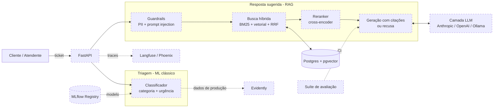

# Arquitetura

> Documento vivo: cada fase atualiza o diagrama e as decisões. Componentes ainda
> não implementados aparecem tracejados.

## Visão geral (alvo)

## Estado atual (Fase 0)

- Pacote `supportai` com layout `src/`, um subpacote por responsabilidade.
- Configuração central em `src/supportai/config.py` (pydantic-settings), lida de variáveis de ambiente / `.env`.
- Postgres 16 + pgvector via `docker compose`.
- CI: ruff, mypy (strict), pytest, com Postgres + pgvector como service container.

## Decisões

Ver [ADRs](decisions/).
