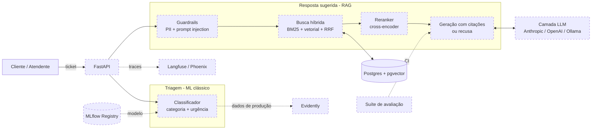
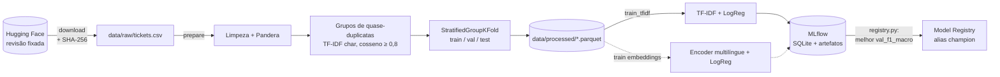
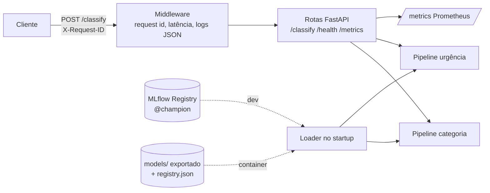

# Arquitetura

> Documento vivo: cada fase atualiza o diagrama e as decisões. Componentes ainda
> não implementados aparecem tracejados.

## Visão geral (alvo)

## Estado atual (Fase 0)

- Pacote `supportai` com layout `src/`, um subpacote por responsabilidade.
- Configuração central em `src/supportai/config.py` (pydantic-settings), lida de variáveis de ambiente / `.env`.
- Postgres 16 + pgvector via `docker compose`.
- CI: ruff, mypy (strict), pytest, com Postgres + pgvector como service container.

## Estado atual (Fase 1)

Pipeline de dados e treino da triagem, orquestrado pelo DVC (`dvc.yaml`):

- `src/supportai/data/`: config tipada (`configs/data.yaml`), download, schemas Pandera, limpeza,
  split agrupado e loader da base de conhecimento.
- `src/supportai/classifier/`: pipelines sklearn (texto cru → rótulo), métricas, treino com MLflow
  e promoção do campeão.
- Métricas versionadas no git em `reports/` (`data.json`, `train_*.json`).

## Estado atual (Fase 2)

- `src/supportai/api/`: app factory, carregamento dos modelos (registry ou diretório), schemas
  Pydantic, logging JSON e métricas Prometheus.
- `supportai.classifier.export`: copia os campeões do registry para `models/`, embutidos na imagem.
- `Dockerfile` multi-stage; o CI constrói a imagem e faz smoke test.

## Decisões

Ver [ADRs](decisions/).
